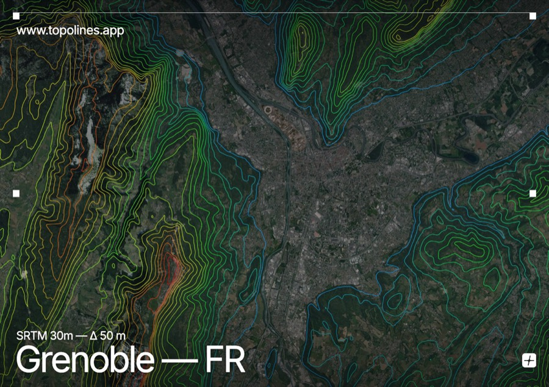
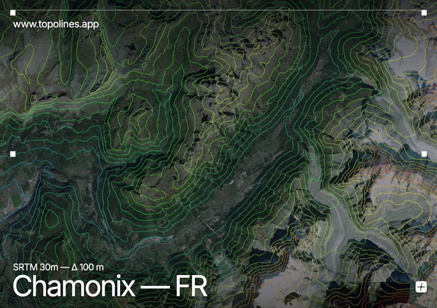
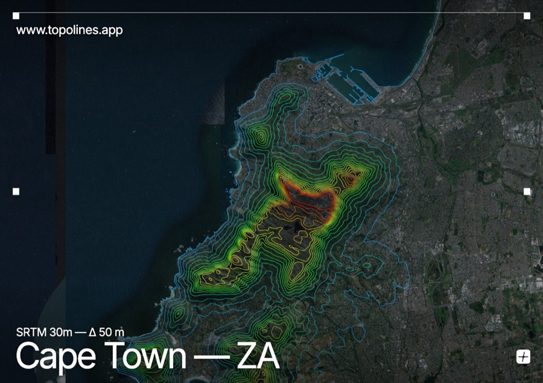
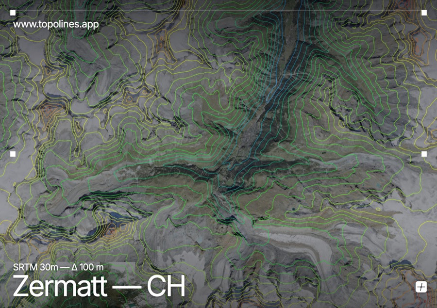
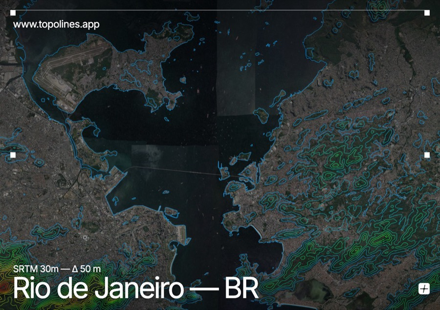
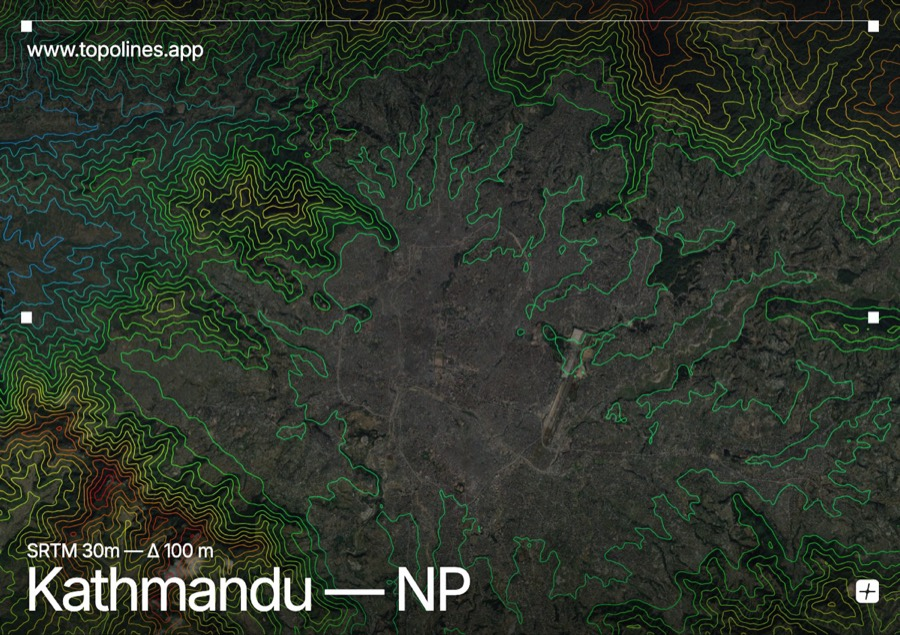
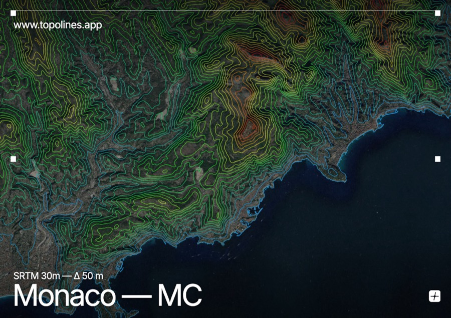

# TopoLines

**Turn any place on Earth into topographic line art.**

Generate precise, fully customisable contour maps from real elevation data — and export them as clean SVG or HD PNG, ready for Figma, print, or laser cutting.

[**Open the app →**](https://www.topolines.app/app) · [Website](https://www.topolines.app) · [Browse maps](https://www.topolines.app/topographic-map) · [Blog](https://www.topolines.app/blog)

---

## What it is

TopoLines is a web tool for designers and makers. Search any location, drag a box over it, and get the **real topography** of that area as editable vector paths.

It was built by a brand/UX designer who needed it for client work: the existing options were either professional GIS suites with a steep learning curve, or one-off files you can't edit afterwards.

**Every map comes from real elevation data** — SRTM 30 m or 10 m GeoTIFF — not from a procedural pattern generator.

## Features

- 🌍 **Real elevation data** — SRTM 30 m worldwide, 10 m GeoTIFF on paid tiers
- 🎚️ **Fully parametric** — contour interval in metres, simplification, stroke width, line joins
- 🎨 **Elevation-driven colour** — gradient stops mapped from lowest to highest contour
- 〰️ **Stroke taper** — line weight varies with altitude for a hand-drawn feel
- 🌊 **Real coastlines** — clipped against OpenStreetMap shorelines, so lines never float out to sea
- 📐 **Clean SVG export** — opens as editable paths in Figma and Illustrator, no cleanup needed
- 🖼️ **HD PNG export** — up to 3200 px
- 🧩 **Figma plugin** — generate contours without leaving your canvas
- 🆓 **Free tier that actually exports** — no account needed to download a real PNG

## Gallery

Every image below was generated with TopoLines from real elevation data.

| | |
|---|---|
|  **Chamonix** — Mont Blanc massif |  **Cape Town** — Table Mountain |
|  **Zermatt** — Matterhorn |  **Rio de Janeiro** — Tijuca massif |
|  **Kathmandu** — valley rim |  **Monaco** — sea to 1,100 m |

More: [topolines.app/topographic-map](https://www.topolines.app/topographic-map)

## Documentation

| Guide | What's in it |
|---|---|
| [Getting started](docs/getting-started.md) | Your first map in under a minute |
| [Contour settings](docs/contour-settings.md) | Interval, relative mode, simplification, taper, gradient |
| [Exports & credits](docs/exports.md) | PNG tiers, SVG, how credits are calculated |
| [Figma plugin](docs/figma-plugin.md) | Generating contours inside Figma |
| [Data sources](docs/data-sources.md) | Where the elevation and coastline data comes from |
| [FAQ](docs/faq.md) | Licensing, commercial use, accuracy, limits |

## Feedback & feature requests

This repository is the public home for **documentation, feedback and roadmap**.

- 💡 [Request a feature](../../issues/new?template=feature_request.md)
- 🐛 [Report a bug](../../issues/new?template=bug_report.md)

Feature requests are genuinely read and prioritised — several shipped features started as user suggestions.

## Pricing

Free to try, no account required. Paid features (HD PNG, SVG export, 10 m data, larger areas) run on one-off credit packs — **no subscription**, and credits never expire.

See [current pricing](https://www.topolines.app/#pricing).

---

Built by [Alexis Oulès](https://www.topolines.app) · [topolines.app](https://www.topolines.app)

*This repository contains documentation and media only. TopoLines is a commercial product; its source code is not public.*

